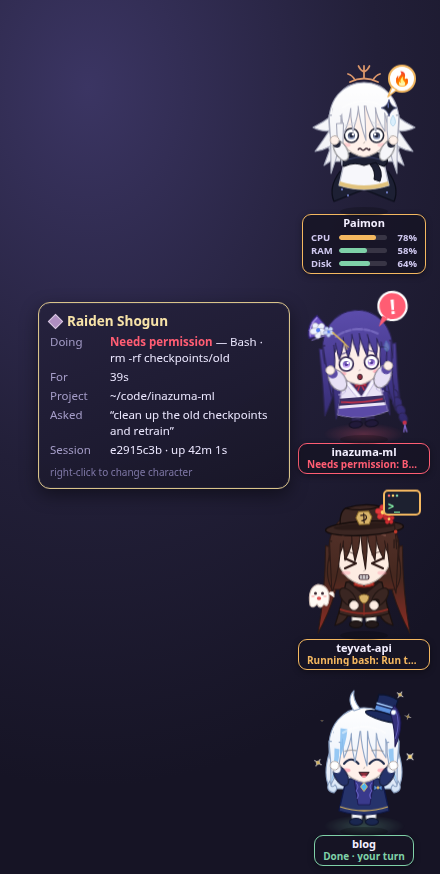
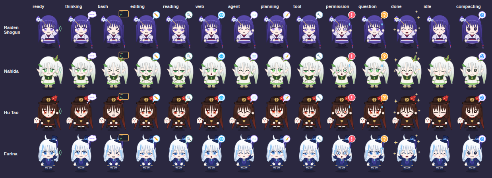
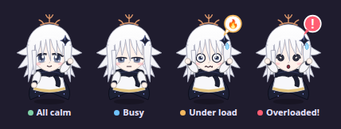
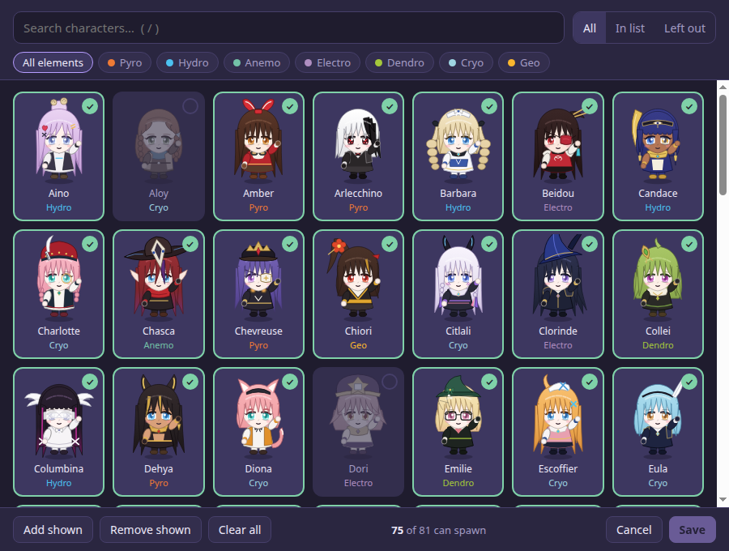
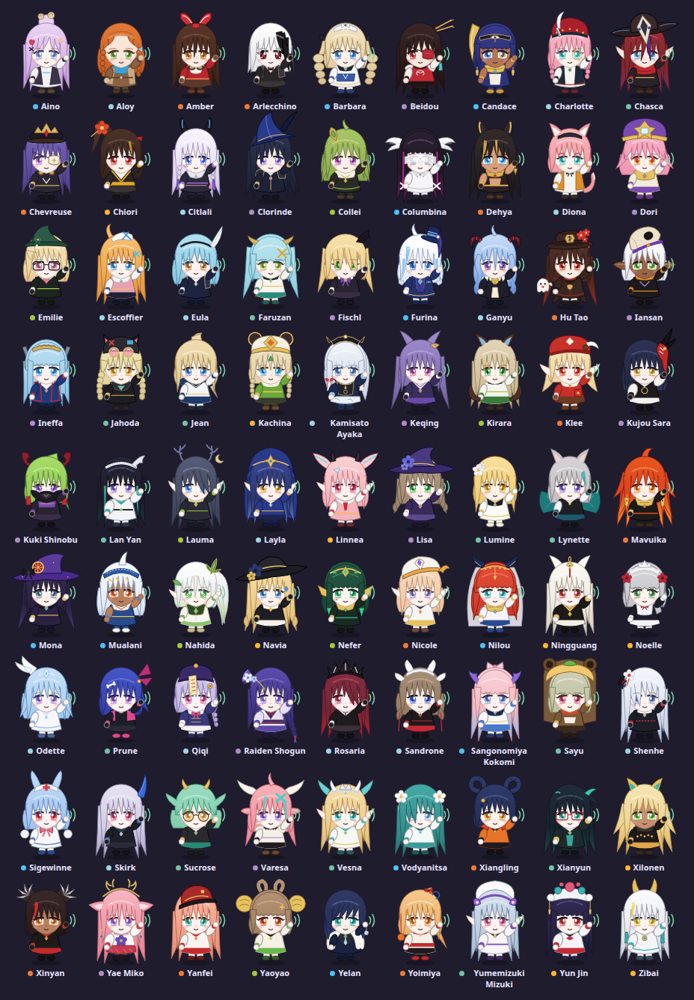

# Archonthropic

*Archons* (the gods of Teyvat) × *Anthropic*: a Genshin chibi companion for every Claude Code session.

Each live session gets its own character on the right edge of your secondary monitor, and her expression
shows what the session is doing: thinking, running a command, waiting for your permission, or done and
waiting for you. Paimon floats on top and keeps an eye on the machine.

<p align="center">
  
  &nbsp;
  
</p>

## What the faces mean



| State | Looks like |
|---|---|
| Thinking | eyes up, thought bubble |
| Running bash | `> <` determined face, terminal bubble; the label shows the command's description |
| Editing · Reading · Web · Subagent · Planning · Tool | focused face with a ✏️ 🔍 🌐 📨 📝 🔧 bubble |
| **Needs permission** | wide eyes, sweat, red **!**, jumping, glowing aura |
| **Has a question** (AskUserQuestion, plan approval) | worried, orange **?** |
| **Done · your turn** | ^▽^ happy, sparkles, cheering |
| Idle (done for 5+ min) | asleep, Zzz |
| Compacting | dizzy spiral eyes |

Hover a character for the project path, the last prompt and how long she's been in that state.
Right-click her to change character (remembered per project) or copy the project path.

### Paimon

<p align="center"></p>

Paimon shows CPU, RAM and disk gauges, and her mood follows whichever is worst. Under load she shows
a 🔥, 🧠 or 💾 bubble for the culprit. CPU is averaged over about 6 seconds, so short spikes don't set her off.
Hover her for load averages, memory and swap, per-disk usage and the busiest processes.

| Mood | CPU | RAM | Disk |
|---|---|---|---|
| All calm | below 40% | below 65% | below 85% |
| Busy | from 40% | from 65% | from 85% |
| Under load | from 75% | from 82% | from 92% |
| Overloaded! | from 92% | from 93% | from 97% |

## Setup

**You need:** Linux (built on Ubuntu with GNOME; X11 and Wayland both work), [Node.js](https://nodejs.org) 20+,
python3, git and [Claude Code](https://claude.com/claude-code). macOS and Windows aren't supported.

```bash
git clone https://github.com/AlisaLC/Archonthropic.git archonthropic
cd archonthropic
bin/setup.sh
```

`bin/setup.sh` is safe to re-run. It:

1. runs `npm install`, which downloads Electron (about 100 MB);
2. adds the Archonthropic hooks to `~/.claude/settings.json`, keeping your existing settings and writing a backup first;
3. binds **Super+Shift+G** to show and hide the companions (GNOME only; elsewhere, bind `bin/toggle.sh` yourself);
4. starts the app at login;
5. launches it.

Options: `--no-shortcut`, `--no-autostart`, `--shortcut '<Super><Alt>p'`.

Then open a Claude Code session and a character appears. Sessions that were already open show up as idle
until you restart them. The tray icon lets you switch monitors, turn Paimon off, edit the spawn list or quit.

To see every state without real sessions, run `npm run demo` (or `node bin/demo.js 7` for 7 fake sessions).

- **Update:** `git pull && bin/setup.sh`
- **Uninstall:** `bin/uninstall.sh` removes the hooks, shortcut and autostart entry, and keeps your config.

<details>
<summary>Installing by hand</summary>

```bash
npm install
npm run install-hooks           # or: npm run uninstall-hooks
bin/install-shortcut.sh         # optional binding argument, default '<Super><Shift>g'
bin/install-autostart.sh
bin/start.sh                    # runs in the background; `npm start` runs it in the foreground
```

</details>

### Troubleshooting

- **Nothing shows up.** Check `~/.local/state/archonthropic/app.log`, and whether `~/.local/state/archonthropic/sessions`
  gets files while Claude works. Hook errors go to `~/.local/state/archonthropic/hook-errors.log`.
- **`npm install` fails downloading Electron.** Retry, or run `node node_modules/electron/install.js` with Node 22+.
- **Wrong monitor.** Pick one under tray icon → Monitor, or set `display` in the config.

## Characters

All 81 characters (every playable woman in Genshin, plus Lumine) are original SVG chibis. A project keeps
the character it got first; a new project gets one picked from its path, skipping anyone already on screen.

To choose who can spawn, open **Spawn list…** from the right-click or tray menu, tick the characters you want
and **Save**. Projects and open sessions that had a character you left out get someone else.
Keys: `/` search, `Enter` toggles the top match, `Ctrl+S` saves, `Esc` clears the search or closes
(press it twice to discard unsaved changes).



<details>
<summary>All 81 characters and their ids</summary>



`raiden nahida hutao ganyu yae ayaka furina yelan aino aloy amber arlecchino barbara beidou candace charlotte chasca chevreuse chiori citlali clorinde collei columbina dehya diona dori emilie escoffier eula faruzan fischl iansan ineffa jahoda jean kachina keqing kirara klee kokomi kuki lanyan lauma layla linnea lisa lynette mavuika mona mualani navia nefer nicole nilou ningguang noelle odette prune qiqi rosaria sandrone sara sayu shenhe sigewinne skirk sucrose lumine varesa vesna vodyanitsa xiangling xianyun xilonen xinyan yanfei yaoyao yoimiya mizuki yunjin zibai`

</details>

## Config

`~/.config/archonthropic/config.json`. Everything is optional:

| Key | Default | |
|---|---|---|
| `display` | `"secondary"` | `"secondary"` (falls back to primary), `"primary"`, or a display index |
| `scale` | `1` | size multiplier, e.g. `1.3` |
| `idleAfterMinutes` | `5` | when "your turn" becomes "asleep" |
| `systemMonitor` | `true` | show Paimon |
| `disks` | `["/"]` | mount points Paimon watches, e.g. `["/", "/home"]` |
| `assignments` | `{}` | project directory → character id |
| `banned` | `[]` | character ids never handed out (what the spawn list edits) |

An invalid value falls back to its default. If the file isn't valid JSON, the app starts with defaults and
keeps your file as `config.json.bad`.

## How it works

`hooks/archonthropic-hook.js` runs on Claude Code's session, prompt, tool, notification, stop and compact hooks.
It writes the session's state to `~/.local/state/archonthropic/sessions/<id>.json`, along with the `claude` PID
so crashed sessions disappear too. The Electron app watches that folder and draws everything in one transparent
window. Only the characters catch the mouse; everything else clicks through.

**Limitations**
- After you approve a permission prompt, the character shows "needs permission" until the tool finishes,
  because Claude Code sends no event on approval.
- A focused full-screen window (a video, a photo viewer) covers the companions. They sit in a "dock" layer
  rather than always-on-top because GNOME sends new windows that overlap an always-on-top window to the background.

<details>
<summary>Development tools</summary>

- `tools/gallery.html` shows every character in every state; `tools/shot.js` renders it to a PNG.
- `electron --no-sandbox --ozone-platform=x11 tools/readme-shots.js` regenerates the images in `docs/`
  offscreen. The GIF needs `ffmpeg`.
- `tools/compare.html` puts each chibi next to its in-game icon. The comment at its top explains how to download the
  icons; render it with `SHOT_PAGE=compare.html SHOT_QUERY='?ref=/abs/icon/dir' SHOT_OUT=out.png electron --no-sandbox tools/shot.js`.

</details>

---

A fan project, not affiliated with or endorsed by HoYoverse or Anthropic. Genshin Impact characters belong to
HoYoverse; the chibis here are original SVG drawings.
